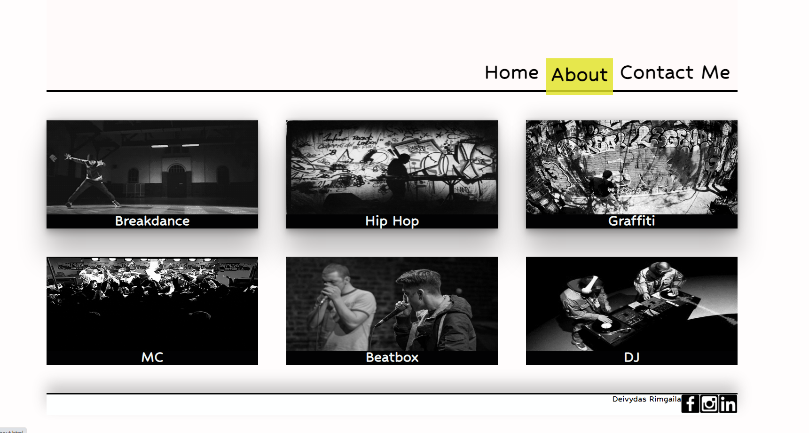

# CodeNation Website project

### Screenshot

- Live Site URL: [https://stalius4.github.io/hip_hop/](https://stalius4.github.io/hip_hop/)

### Built with

- Semantic HTML5 markup
- CSS custom properties
- Flexbox
- CSS Grid

### My challenges

 - How to change color and move nav bar on top of the line below when hover on it without moving line and other objects.
 - Make page responsive for mobile phones.

### Useful resources

- [CSS Flexbox](https://css-tricks.com/snippets/css/a-guide-to-flexbox/) - Great cheatsheet for CSS Flexbox
- [CSS Grid](https://css-tricks.com/snippets/css/complete-guide-grid/) - Complete guide to grid.
- [CSS box-shadow examples](https://getcssscan.com/css-box-shadow-examples) - Beautiful CSS box-shadow examples

## Acknowledgments
 I would like to thank to Code Nation and Keira for showing me how to use HTML, CSS and create my own webpage.
